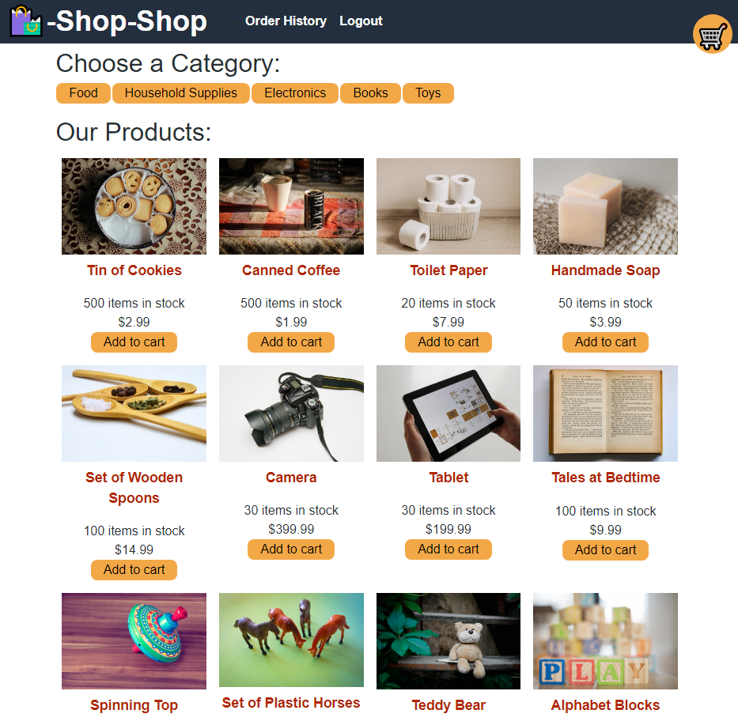

# Shop-Redux

## License

## Table of Contents

 * [Installation](#installation)
 * [Usage](#usage)
 * [Credits](#credits)
 * [License](#license)
 
## Description

## <a href="https://adamr-work.github.io/Shop-Redux/" target="_blank">CLICK TO GO TO THE SITE</a>

It takes a Shopping marketplace that I put together and made it redux.

## Usage

Through apollo/express/mongodb using react and ES6

## Installation

> npm i 

Which will install the following along with some of the smaller counterparts they use:

> apollo express mongodb react redux

## Languages

JavaScript ,HTML ,CSS ,ES6 ,Bootstrap ,Node 

## Questions

Contact me at:

https://github.com/AdamR-Work/Shop-Redux

## Contributing

## Tests

I have a test to check the reducers.js

>npm run test

## Credits

